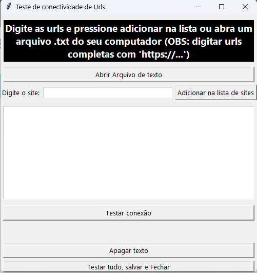

# Fundamentos de Computação - Atividade Prática II

Este programa se trata de uma aplicação simples em Python que permite receber um ou mais URLs como argumento e retorna o status de cada website.

Ao final do projeto deveremos ter a seguinte estrutura de arquivos:

```
README.md
requirements.txt
site_checker.sh
sitechecker.py
```
# Instruções de uso

## 1. Criar o ambiente de trabalho


```
